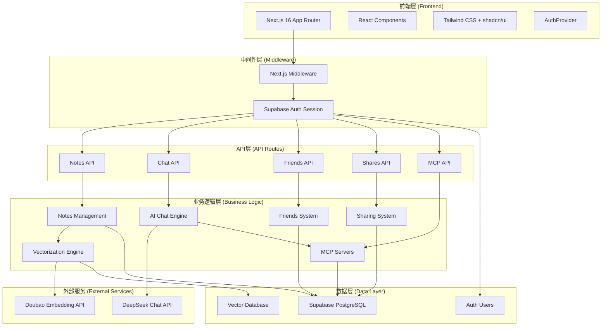
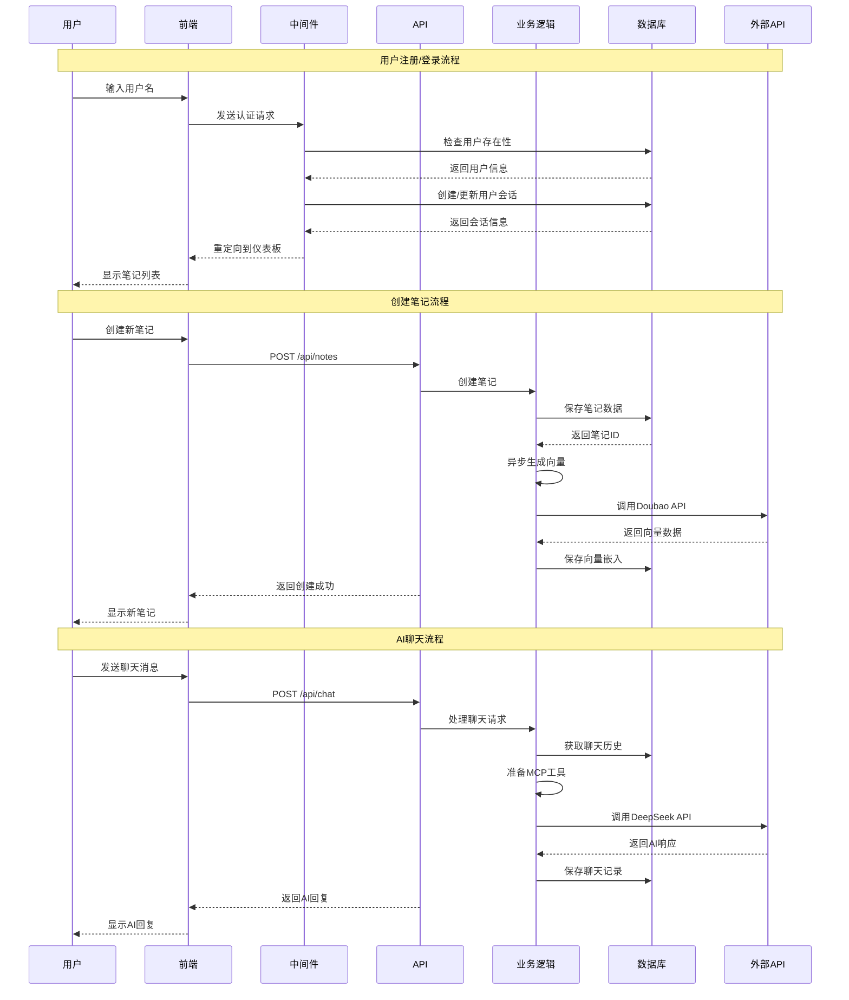
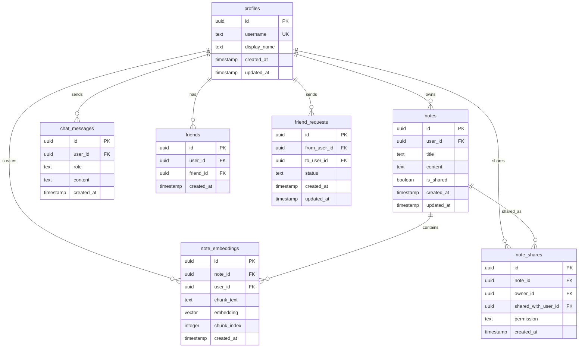
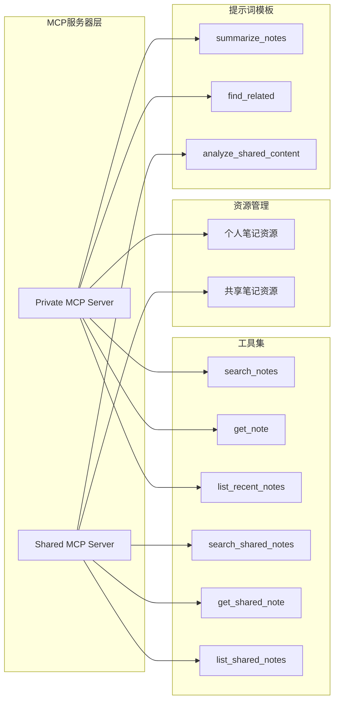
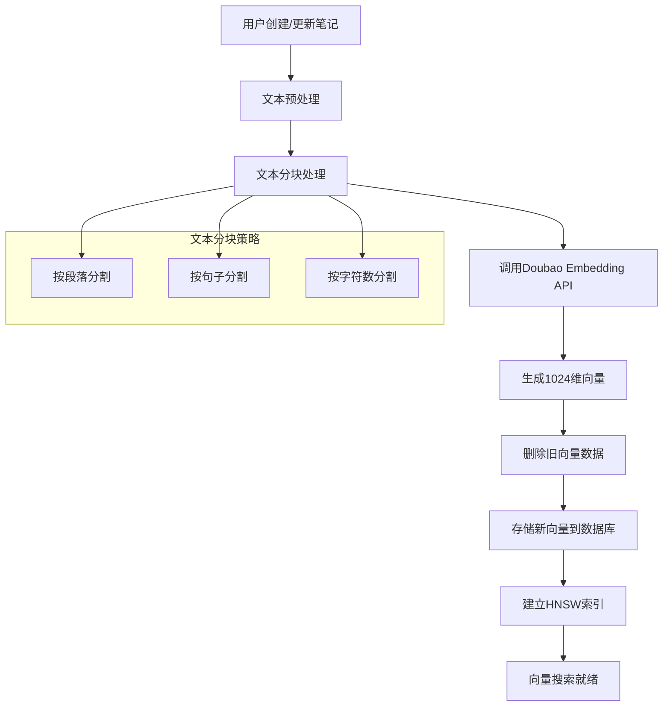
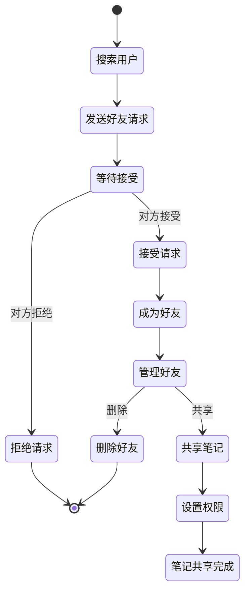
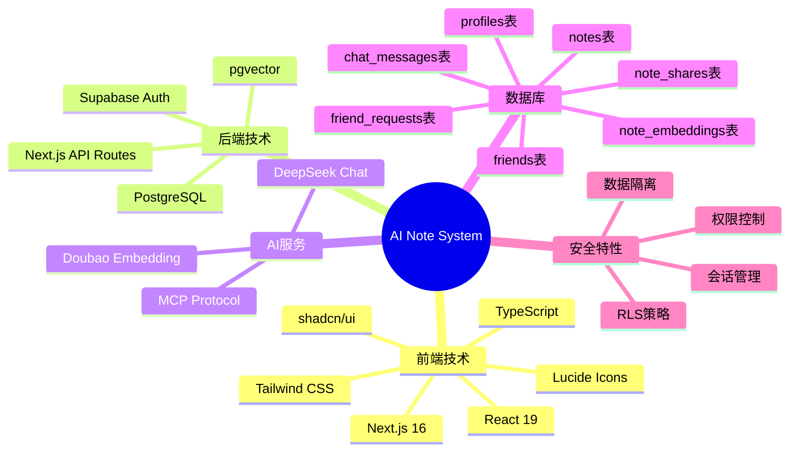
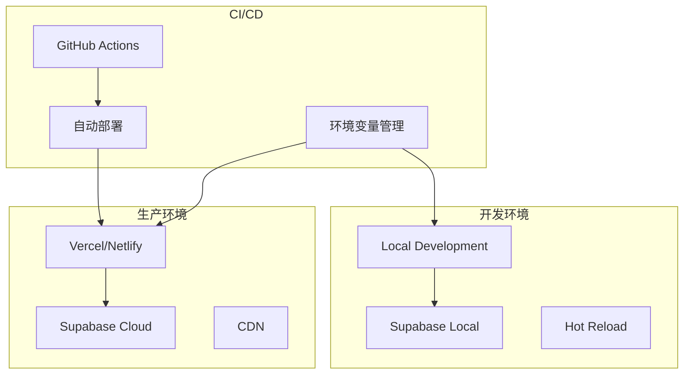
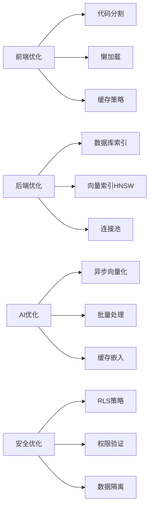
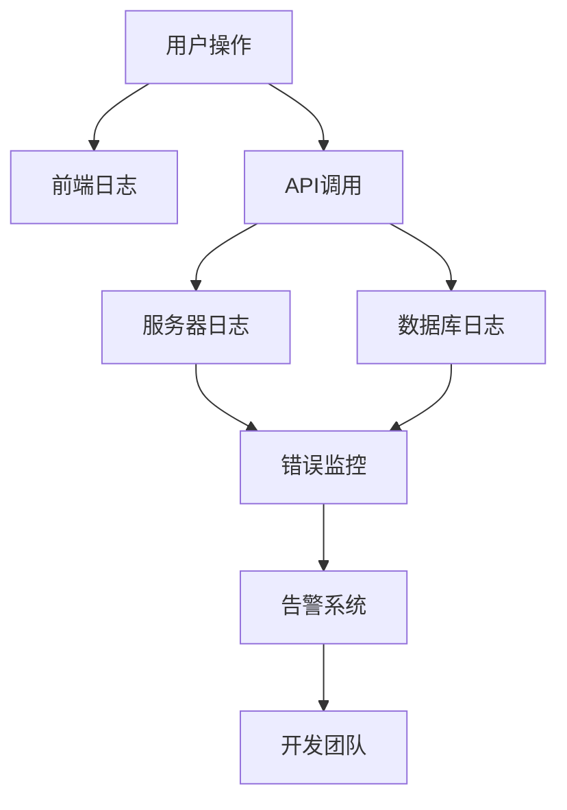

# AI Note System - 架构设计图

## 系统整体架构

## 用户操作流程

## 数据库架构

## MCP服务器架构

## 向量化处理流程

## 好友系统操作流程

## 系统技术栈

## 部署架构

## 性能优化策略

## 监控和日志

---

## 总结

这个AI笔记系统采用了现代化的全栈架构，具有以下特点：

1. **分层架构**: 清晰的前端、API、业务逻辑和数据层分离
2. **微服务化**: MCP服务器提供标准化的工具接口
3. **AI集成**: 深度集成向量搜索和AI聊天功能
4. **社交功能**: 完整的好友系统和笔记共享机制
5. **安全性**: 全面的权限控制和数据隔离
6. **可扩展性**: 模块化设计，易于扩展新功能
7. **性能优化**: 向量索引、异步处理、缓存策略

整个系统为用户提供了智能化的笔记管理体验，支持语义搜索、AI对话和社交协作功能。

